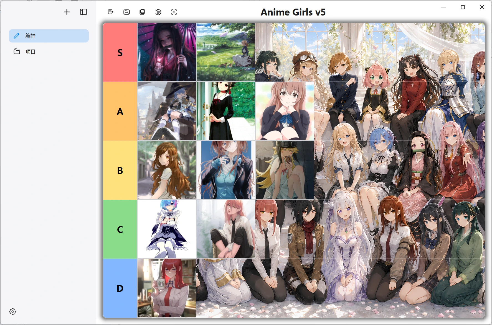
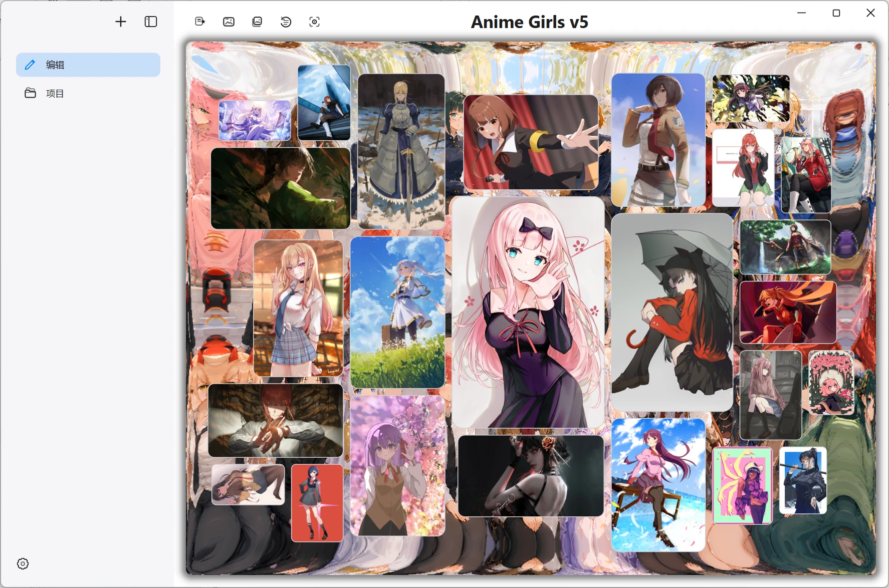

# QTierMaker

QTierMaker is a native Qt desktop app for building personal tier lists on Windows, macOS,
and Linux. Projects stay local and keep their imported images, tier structure, background, and
presentation settings together.

## macOS Installation

The macOS build is distributed without Apple notarization. After copying QTierMaker to
Applications, try to open it once, then open **System Settings > Privacy & Security** and choose
**Open Anyway**. Confirm **Open** when macOS asks again.

## Edit and Arrange

Arrange images directly on the tier board, customize tiers and backgrounds, and keep unranked
images ready in the project gallery.

## Gallery Overview

Gallery Overview brings the full image collection into one balanced canvas for quick scanning,
selection, and preview.

## Image Preview

Preview presents the selected image against the project background without leaving the current
workspace.
